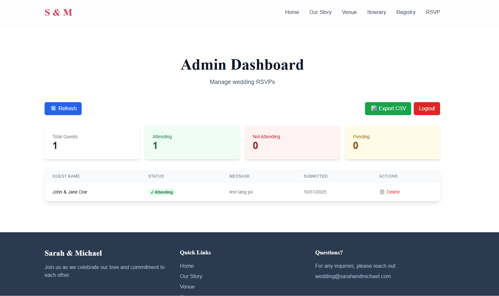

<div align="center">

# 💍 Wedding RSVP Website  

**A beautiful, secure, and modern wedding website with a code-gated RSVP system**

[Features](#-features) • [Tech Stack](#-tech-stack) • [Screenshots](#-screenshots) • [Getting Started](#-getting-started) • [Admin Dashboard](#-admin-dashboard) • [Deployment](#-deployment)


</div>

---

## 📸 Screenshots

<div align="center">

### 🏠 Hero Section


### 🧑‍💼 Admin Dashboard


</div>

---

## ✨ Features

### 🎨 Beautiful Design
- Elegant, modern UI with smooth Framer Motion animations  
- Fully responsive (mobile, tablet, desktop)  
- Clean typography with Google Fonts (Playfair Display, Inter)  
- Consistent styling using Tailwind CSS  

### 🔐 Secure RSVP System
- Code-gated authentication (one unique code per guest)  
- Bcrypt password hashing for secure invitation codes  
- Server-side validation with Firebase Admin SDK  
- Prevents duplicate submissions  

### 👥 Guest Management
- Add guests via scripts with unique invitation codes  
- Track RSVP status (Attending / Not Attending / Pending)  
- Collect messages and timestamps  
- Export data to CSV  

### 📊 Admin Dashboard
- Real-time statistics (Total, Attending, Not Attending, Pending)  
- Searchable and filterable guest list  
- Password-protected access  
- Delete or refresh guest data  

### 📱 Multiple Pages
- **Home** — Hero section with countdown timer  
- **Our Story** — Relationship timeline  
- **Venue** — Location details and directions  
- **Itinerary** — Wedding day schedule  
- **Registry** — Gift links  
- **RSVP** — Secure RSVP form  
- **Admin** — Dashboard for guest management  

---

## 🛠️ Tech Stack

| Category | Technology |
|-----------|-------------|
| **Framework** | Next.js 15 (App Router) |
| **Frontend** | React 19, TypeScript 5.0 |
| **Styling** | Tailwind CSS 3.4, Framer Motion |
| **Database** | Firebase Firestore |
| **Authentication** | Custom code-based system |
| **Deployment** | Vercel |
| **Password Hashing** | bcryptjs |

---

## 🚀 Getting Started

### Prerequisites
- Node.js 18+  
- npm or yarn  
- Firebase account (free tier works)  
- Git installed  

### Installation

```bash
# 1. Clone the repository
git clone https://github.com/terddyy/wedding-rsvp.git
cd wedding-rsvp

# 2. Install dependencies
npm install

# 3. Copy environment variables
cp .env.example .env.local
Configuration
Create a .env.local file with your Firebase credentials:

env
Copy code
# Firebase Client Config
NEXT_PUBLIC_FIREBASE_API_KEY=your_api_key
NEXT_PUBLIC_FIREBASE_AUTH_DOMAIN=your_auth_domain
NEXT_PUBLIC_FIREBASE_PROJECT_ID=your_project_id
NEXT_PUBLIC_FIREBASE_STORAGE_BUCKET=your_storage_bucket
NEXT_PUBLIC_FIREBASE_MESSAGING_SENDER_ID=your_sender_id
NEXT_PUBLIC_FIREBASE_APP_ID=your_app_id

# Firebase Admin Config (Service Account)
FIREBASE_PROJECT_ID=your_project_id
FIREBASE_CLIENT_EMAIL=your_service_account_email
FIREBASE_PRIVATE_KEY=your_private_key

# Admin Password
ADMIN_PASSWORD=your_secure_admin_password
Development
bash
Copy code
# Run development server
npm run dev

# Open in browser
# http://localhost:3000
📊 Admin Dashboard
Access the admin dashboard at /admin to:

View real-time RSVP statistics

Search and filter guests

Export guest list to CSV

Manage guest data

Default Admin Route: /admin
Authentication: Password-protected (set in .env.local)

🎯 Adding Guests
Use the provided scripts to add guests and generate invitation codes:

bash
Copy code
# Generate invitation codes
npm run generate-codes

# Add guests to database
npm run add-guests
🚢 Deployment
Deploy to Vercel
Push your code to GitHub

Import your repository in Vercel

Add environment variables in the Vercel dashboard

Deploy!

Or use the CLI:

bash
Copy code
npm i -g vercel
vercel
📝 License
This project is open source and available under the MIT License.

👤 Author
terddyy

GitHub: @terddyy

