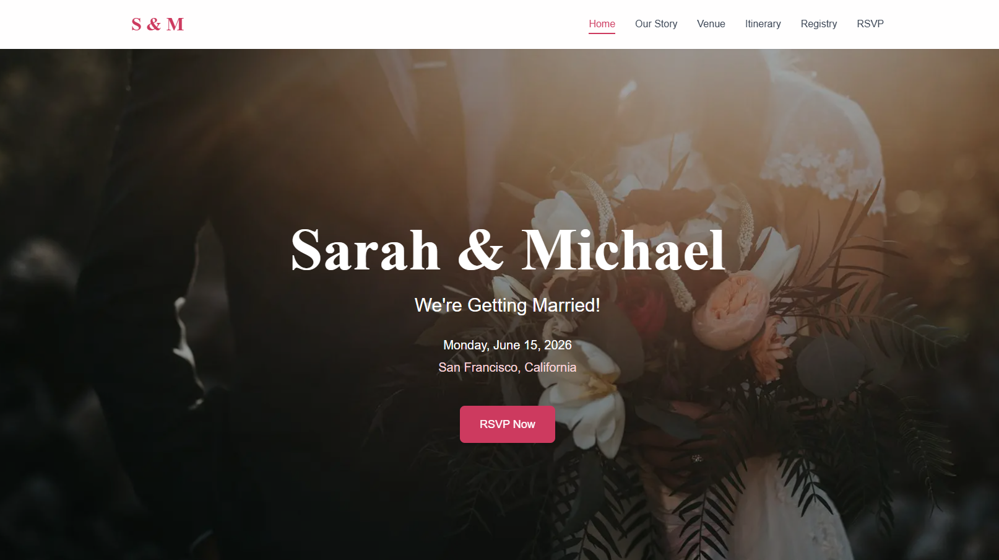

<div align="center"><div align="center">


# 💍 Wedding RSVP Website  # 💍 Wedding RSVP Website  

**A beautiful, secure, and modern wedding website with a code-gated RSVP system****A beautiful, secure, and modern wedding website with a code-gated RSVP system**


[Features](#-features) • [Tech Stack](#-tech-stack) • [Screenshots](#-screenshots) • [Getting Started](#-getting-started) • [Admin Dashboard](#-admin-dashboard) • [Deployment](#-deployment)[Features](#-features) • [Tech Stack](#-tech-stack) • [Getting Started](#-getting-started) • [Admin Dashboard](#-admin-dashboard) • [Deployment](#-deployment)


</div></div>


------


## ✨ Features## ✨ Features


### 🎨 Beautiful Design### 🎨 Beautiful Design

- Elegant, modern UI with smooth Framer Motion animations  - Elegant, modern UI with smooth Framer Motion animations  

- Fully responsive (mobile, tablet, desktop)  - Fully responsive (mobile, tablet, desktop)  

- Clean typography with Google Fonts (Playfair Display, Inter)  - Clean typography with Google Fonts (Playfair Display, Inter)  

- Consistent styling using Tailwind CSS  - Consistent styling using Tailwind CSS  


### 🔐 Secure RSVP System### 🔐 Secure RSVP System

- Code-gated authentication (one unique code per guest)  - Code-gated authentication (one unique code per guest)  

- Bcrypt password hashing for secure invitation codes  - Bcrypt password hashing for secure invitation codes  

- Server-side validation with Firebase Admin SDK  - Server-side validation with Firebase Admin SDK  

- Prevents duplicate submissions  - Prevents duplicate submissions  


### 👥 Guest Management### 👥 Guest Management

- Add guests via scripts with unique invitation codes  - Add guests via scripts with unique invitation codes  

- Track RSVP status (Attending / Not Attending / Pending)  - Track RSVP status (Attending / Not Attending / Pending)  

- Collect messages and timestamps  - Collect messages and timestamps  

- Export data to CSV  - Export data to CSV  


### 📊 Admin Dashboard### 📊 Admin Dashboard

- Real-time statistics (Total, Attending, Not Attending, Pending)  - Real-time statistics (Total, Attending, Not Attending, Pending)  

- Searchable and filterable guest list  - Searchable and filterable guest list  

- Password-protected access  - Password-protected access  

- Delete or refresh guest data  - Delete or refresh guest data  


### 📱 Multiple Pages### 📱 Multiple Pages

- **Home** — Hero section with countdown timer  - **Home** — Hero section with countdown timer  

- **Our Story** — Relationship timeline  - **Our Story** — Relationship timeline  

- **Venue** — Location details and directions  - **Venue** — Location details and directions  

- **Itinerary** — Wedding day schedule  - **Itinerary** — Wedding day schedule  

- **Registry** — Gift links  - **Registry** — Gift links  

- **RSVP** — Secure RSVP form  - **RSVP** — Secure RSVP form  

- **Admin** — Dashboard for guest management  - **Admin** — Dashboard for guest management  


------


## 🛠️ Tech Stack## 🛠️ Tech Stack


| Category | Technology || Category | Technology |

|-----------|-------------||-----------|-------------|

| **Framework** | Next.js 15 (App Router) || **Framework** | Next.js 15 (App Router) |

| **Frontend** | React 19, TypeScript 5.0 || **Frontend** | React 19, TypeScript 5.0 |

| **Styling** | Tailwind CSS 3.4, Framer Motion || **Styling** | Tailwind CSS 3.4, Framer Motion |

| **Database** | Firebase Firestore || **Database** | Firebase Firestore |

| **Authentication** | Custom code-based system || **Authentication** | Custom code-based system |

| **Deployment** | Vercel || **Deployment** | Vercel |

| **Password Hashing** | bcryptjs || **Password Hashing** | bcryptjs |


------


## 📸 Screenshots## 🚀 Getting Started


### Hero Section### Prerequisites

<div align="center">- Node.js 18+  

  - npm or yarn  

</div>- Firebase account (free tier works)  

- Git installed  

### Admin Dashboard

<div align="center">### Installation

  

</div>```bash

# 1. Clone the repository

---git clone https://github.com/terddyy/wedding-rsvp.git

cd wedding-rsvp

## 🚀 Getting Started

# 2. Install dependencies

### Prerequisitesnpm install

- Node.js 18+  

- npm or yarn  # 3. Copy environment variables

- Firebase account (free tier works)  cp .env.example .env.local

- Git installed  

### Installation

```bash
# 1. Clone the repository
git clone https://github.com/terddyy/wedding-rsvp.git
cd wedding-rsvp

# 2. Install dependencies
npm install

# 3. Copy environment variables
cp .env.example .env.local
```

### Configuration

Create a `.env.local` file with your Firebase credentials:

```env
# Firebase Client Config
NEXT_PUBLIC_FIREBASE_API_KEY=your_api_key
NEXT_PUBLIC_FIREBASE_AUTH_DOMAIN=your_auth_domain
NEXT_PUBLIC_FIREBASE_PROJECT_ID=your_project_id
NEXT_PUBLIC_FIREBASE_STORAGE_BUCKET=your_storage_bucket
NEXT_PUBLIC_FIREBASE_MESSAGING_SENDER_ID=your_sender_id
NEXT_PUBLIC_FIREBASE_APP_ID=your_app_id

# Firebase Admin Config (Service Account)
FIREBASE_PROJECT_ID=your_project_id
FIREBASE_CLIENT_EMAIL=your_service_account_email
FIREBASE_PRIVATE_KEY=your_private_key

# Admin Password
ADMIN_PASSWORD=your_secure_admin_password
```

### Development

```bash
# Run development server
npm run dev

# Open in browser
# http://localhost:3000
```

---

## 📊 Admin Dashboard

Access the admin dashboard at `/admin` to:
- View real-time RSVP statistics
- Search and filter guests
- Export guest list to CSV
- Manage guest data

**Default Admin Route:** `/admin`  
**Authentication:** Password-protected (set in `.env.local`)

---

## 🎯 Adding Guests

Use the provided scripts to add guests and generate invitation codes:

```bash
# Generate invitation codes
npm run generate-codes

# Add guests to database
npm run add-guests
```

---

## 🚀 Deployment

### Deploy to Vercel

1. Push your code to GitHub
2. Import your repository in Vercel
3. Add environment variables in Vercel dashboard
4. Deploy!

```bash
# Or use Vercel CLI
npm i -g vercel
vercel
```

---

## 📝 License

This project is open source and available under the [MIT License](LICENSE).

---

## 👤 Author

**terddyy**  
- GitHub: [@terddyy](https://github.com/terddyy)

---

<div align="center">
  Made with ❤️ for our special day
</div>
